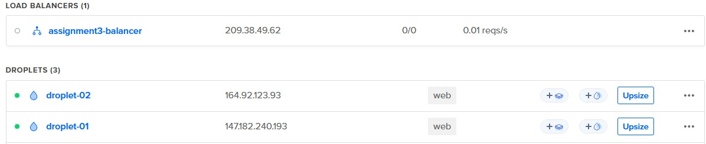
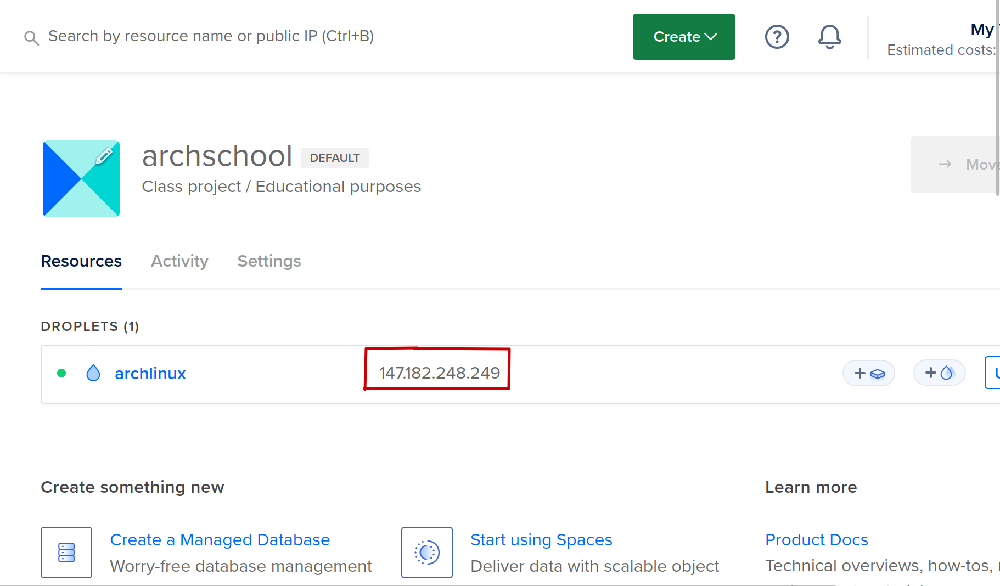
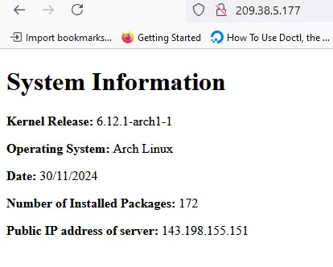

# Web Server setup script
This script creates a system user called "webgen", setup a preconfigured NGINX server that serves a html page containing your system info, and a firewall that allows http and ssh connections on your droplet.


## Prerequisites:
1. Create two droplets in digitalocean with these settings
    ```
    Region = SFO3
    image = latest release of arch linux for cloud
    specs = basic - premium AMD - $7/m
    ```
2. Create a load balancer attached to the new droplets
    ```
    type = regional
    region = SF03
    visibility = External
    tag = web
    ```




3. You MUST have updated your arch linux installation in BOTH droplets to the latest version by running
```bash
sudo pacman -Syu
```
and reload your droplet with
```bash
sudo systemctl reboot
```

4. The ip address of your droplets that you would like to use to setup



5. Clone this repository in both droplets

## How to Run Script

1. Simply run the script with this command but subsitute with your ip address

```bash
sudo bash setup <your-ip-address-here>
```
2. Repeat in second droplet


Once the script has been executed in BOTH droplets, paste your load balancer's ip into the address bar of your browser and you will see this page




Congratulations! you will now have a functioning web server with a load balancer
